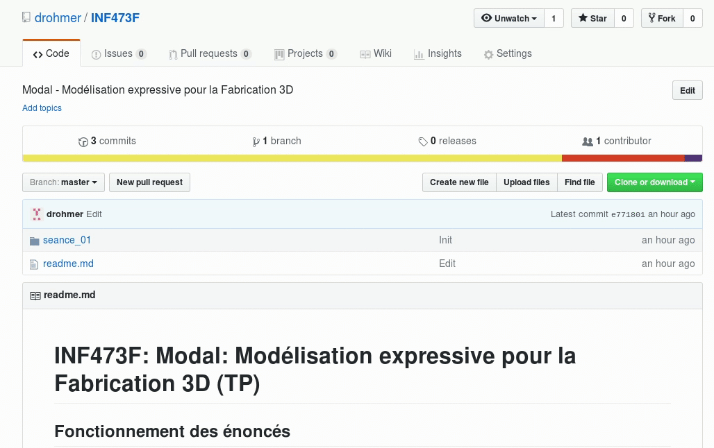

# INF473F: Modal: Modélisation expressive pour la Fabrication 3D (TP)

## Fonctionnement des énoncés

Cette page github contient différents codes d'exemples et tutoriaux pour s'initier à l'utilisation de la librairie Three.js et JavaScript.
* Les énoncés sont directement lisibles en ligne dans l'interface github. Chaque partie est associée à un énoncé apparaissant lorsque vous naviguez dans les répertoires de manière hierarchique.
* Les codes à exécuter et modifier sont disponibles dans les répertoires __src/__ respectifs. Pour exécuter et modifier ces codes, vous devez télécharger le contenu du dépôt sur votre ordinateur (voir point suivant).

Chaque partie présente un point spécifique potentiellement utile pour la réalisation de votre projet. Les parties sont indépendantes, et la séparation en séance 1 et 2 est arbitraire. Il vous est cependant conseillé de suivre les différentes parties dans l'ordre (commencez par seance_01/partie_01, puis partie_02, etc) suivant l'organisation hiérarchique prévue.

Les questions de l'énoncé seront indiquées par __Q__.
Ces questions ont principalement pour objectifs de vous familiariser et vous faire prendre en main le code JavaScript et la bibliothèque Three.js. De manière générale, n'hésitez cependant pas à vous documenter et modifier les codes par vous même au-delà des questions posées, et explorer les voies que vous souhaitez.

## Téléchargement du code

Pour commencer à travailler, téléchargez localement sur votre machine l'ensemble du code. Pour cela, au choix:

* Téléchargez directement une archive .zip que vous décompressez sur votre ordinateur (voir illustration suivante).

* Clonez le projet à l'aide de git. 
Tappez en ligne de commande:
`git clone https://github.com/drohmer/INF473F.git`

Vous pourrez alors gérer, si vous le souhaitez, vos propres versions de code avec git.
