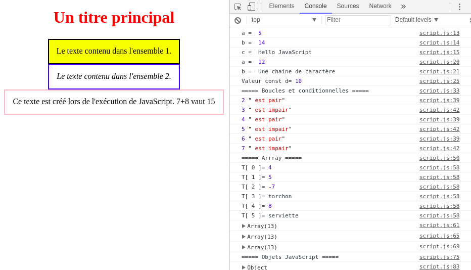

# Programme 01

Ce premier programme présente une page web minimaliste afin de se familiariser avec les notions de HTML, CSS, et JavaScript. Notez que ce premier programme n'est pas lié à Three.js ni à la modélisation 3D, et pourra être passé rapidement si vous possédez déjà des connaissances en développement Web.

### Ouverture de la page web dans le navigateur

__Q.__ Ouvrez le fichier index.html (présent dans src/index.html) en utilisant un navigateur récent. On pourra utiliser par exemple Firefox, Google Chrome/Chromium.

### Fichier HTML

__Q.__ Ouvrez désormais le fichier _index.html_ en utilisant un éditeur de texte. Retrouvez la correspondance entre les éléments visuels affichés par le navigateur et le contenu de la page HTML.
* Notez que pour l'édition de code HTML et JavaScript, vous aurez besoin d'un éditeur de texte. On pourra conseiller [Atom](https://atom.io/) ou [Sublime Text](https://www.sublimetext.com/) par exemple.

Remarque 1: Le troisième élément (bloc encadré rouge) n'est pas directement décrit dans la page HTML. Nous verrons par la suite qu'il est généré lors de l'exécution du code JavaScript.

Remarque 2: On notera que le fichier HTML décrit uniquement la structure et le contenu de la page, mais pas son apparence (couleur, placement des éléments, espacement entre éléments, etc). Cette apparence est gérée dans le fichier style.css.


### Fichier CSS

__Q.__ Ouvrez le fichier _style.css_ avec votre éditeur de texte. Retrouvez les différents aspects graphiques des éléments affichés. Modifiez en quelques-uns et relancez la page HTML pour visualiser le résultat (La touche F5 permet généralement de recharger la page).

Remarque: Les notions d'HTML et de CSS sont données à titre informatif. Dans le cadre de ce modal, la scène 3D étant généralement gérée intégralement par le code JavaScript, vous n'aurez quasiment jamais à écrire de HTML et CSS en dehors de la mise en place basique d'une page web vierge de contenu.

### Code JavaScript

__Q.__ Ouvrez le fichier _script.js_ avec votre éditeur de texte. Il s'agit cette fois d'un code JavaScript qui effectue de nombreux affichages sur une console. Cette console est généralement masquée lors de l'utilisation standard du navigateur et il est nécessaire de lancer le mode "développeur" pour le voir.
* Ouvrez le mode "développeur" ou "debug" de votre navigateur. Généralement la touche F12 permet d'activer ce mode.
* Selectionner l'onglet "Console" de votre navigateur et observez l'affichage des différentes informations obtenues lors de l'exécution du code JavaScript.


_(exemple de console en "mode développeur" sous Chromium)_

<br/>
_Rem._ Cette console permet typiquement de debuger votre application. Notez qu'un mode debug avec points d'arrêts dans le code source est également généralement disponible dans vos navigateurs.

__Q.__ Lisez le déroulement du code JavaScript et des commentaires, et comparez aux résultats visualisés sur la console.
N'hésitez pas à tester différentes valeurs et nous appeler en cas de questions.


### Remarques techniques de __bonnes pratiques__ en programmation Web:

* Le code qui vous est fourni en exemple comporte plusieurs fichiers séparant le contenu de la page html (index.html), l'apparence des éléments html (style.css), et le code d'automatisation (script.js).
Vous pourrez fréquemment trouver sur internet des codes intégrant dans un seul et même fichier html à la fois les balises css et le code JavaScript. Il n'est donc pas nécessaire de passer forcément par des fichiers différents. Cependant, cela permet de séparer les parties indépendantes du code, facilite leur lecture, et les rend potentiellement réutilisables.
Il vous est donc conseillé de décrire votre application web en utilisant différents fichiers indépendants, et de garder au minimum la structure HTML, CSS, JavaScript séparés.

* Le fichier JavaScript débute par la commande
```javascript
"use strict";
```
Il s'agit d'une indication que le reste du code suit les spécifications récentes définies dans la norme ECMAScript 5 et 6. Concrètement, le "mode strict" est moins permissif que les spécifications précédentes de JavaScript, et reflète de meilleures pratiques de programmation. On prendra ainsi l'habitude d'utiliser cette option.

* Les variables du programme sont déclarées par les mots-clés _const_ et _let_. Vous pourrez fréquemment trouver sur internet des codes déclarant les variables avec le mot-clé _var_ à la place. Les mots-clés _const_ et _let_ sont apparus dans les nouvelles normes de JavaScript pour combler certains défauts de _var_:
 * _const_ et _let_ permettent de définir explicitement si les variables peuvent être réaffectées ou non. Une variable déclarée par _var_ peut toujours être réaffectée.
 * _const_ et _let_ ont une portée de type _bloc_. C'est-à-dire qu'elles ne sont utilisables que jusqu'à la fermeture de l'accolade du bloc dans laquelle elles ont été déclarées (typiquement dans une boucle, une conditionnelle, etc). _var_ possède une portée de type _fonction_.
 ```javascript
const x = 15;
if (x>10) {
    var a = 5;
 }
 console.log(a); // Code valide, a existe toujours
```
Alors que
```javascript
const x = 15;
if (x>10) {
    const a = 5;
}
console.log(a); // Code non valide: a n'existe plus
// après la fin de l'accolade.
```
Il est généralement préférable d'avoir les portées de variables locales afin d'éviter des redéfinitions involontaires. Cela facilite également la lecture et la compréhension du code.
> De manière générale, ont suivra donc la règle dans l'ordre de priorité suivant:<br/>
1- On déclarera par défaut les variables en tant que _const_. <br/>
2- Si la variable a besoin d'être réaffectée, alors on la déclarera en tant que _let_. <br/>
3- Si, dans un cas particulier (généralement rare), une variable nécessite une portée plus large que le bloc courant et ne nuit pas à la lisibilité du code, alors on pourra la déclarer en tant que _var_.
