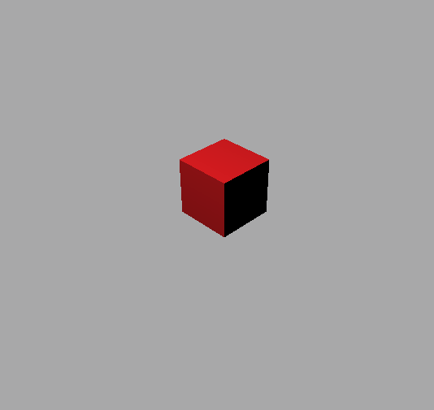

# Programme 01

Ce premier programme présente une scène 3D minimaliste (un cube rouge statique) utilisant Three.js. Ce programme est constitué de 3 fichiers sources (HTML, CSS, JavaScript) et d'un fichier contenant la bibliothèque Three.js.

* Le fichier HTML contient une description des métadonnées de la page web (titre, encodage des caractères, etc) ainsi que les appels aux autres fichiers CSS et JavaScript qui doivent être chargés et interprétés. Le reste de la page étant gérée entièrement par le code Javascript, le corps de la page ne contient quasiment aucune description HTML.
* Le fichier css vient supprimer la marge du corps de l'élément HTML "body". De cette manière, la scène 3D apparait sans marge sur le navigateur.
* Le fichier JavaScript (extension .js) contient le coeur du code d'affichage de la scène 3D.


#### Documentation de Three.js

La documentation et le code de Three.js sont disponibles à l'adresse [https://threejs.org/](https://threejs.org/).

Notamment, les liens suivants vous seront généralement utiles:
* [Code source de Three.js ainsi que les codes des exemples](https://github.com/mrdoob/three.js/)
* [Documentation de référence](https://threejs.org/docs/index.html#manual/introduction/Creating-a-scene)
* [Série d'exemples de scènes 3D](https://threejs.org/examples/)

N'hésitez pas à vous y référer régulièrement.

### Observation du premier programme

__Q.__ Observez les trois fichiers sources et assurez vous que vous puissiez visualiser la scène 3D en ouvrant le fichier HTML par un navigateur. Notez que cette scène est pour l'instant statique (ex. il n'est pas possible de modifier la position de la caméra).



[_Scène 3D visualisée dans le navigateur_](https://htmlpreview.github.io/?https://github.com/drohmer/INF473F/blob/master/seance_01/partie_02_scene_3D/src/index.html)

### Compréhension du fonctionnement du code JavaScript

__Q.__ Observez désormais le fichier scene.js.

#### Remarques générales

* Notez l'utilisateur de l'opérateur _new_ lors de la création d'une instance d'une classe (similaire à l'utilisation de _new_ en Java par exemple). Cela appelle le constructeur de la classe. Ce constructeur peut prendre potentiellement des paramètres.

* Les couleurs sont classiquement définies avec leur code Rouge-Vert-Bleu (en anglais RGB) hexadécimal sur 3 octets. Le symbol '0x' en JavaScript indiquant un nombre donné en hexadécimal. Si cet encodage ne vous est pas familier, vous pouvez vous [référer à cette annexe](color/readme.md).

* Les vecteurs Three.js sont des classes de type [THREE.Vector3](https://threejs.org/docs/#api/math/Vector3). Notez l'utilisation des méthodes _set_ permettant d'affecter de nouvelles coordonnées sans avoir à réaliser de réaffectation de variable.
Il existe également les méthodes _copy_ (réalise la copie des champs de la classe dans une autre) et _clone_ (génère un nouvel objet ayant les mêmes valeurs que l'objet original).

```JavaScript
// Création d'un nouveau vecteur 3D (x=1,y=2,z=5)
const a = new THREE.Vector3(1,2,5);
const b = a; // b réfère au même vecteur que a

// Création d'un autre vecteur 3D
//  Coordonnées par défaut: (0,0,0)
let c = new THREE.Vector3();
c.copy(a); // c contient la copie des coordonnées de a
// c et a réfèrent à des vecteurs différents

let d = a.clone();
// similaire à création d'une nouvelle instance de Vector3
// puis copie des coordonnées de a dans les coordonnées de d
// d et a réfèrent à des vecteurs différents
```


__Q.__ Modifiez la position et l'orientation de la caméra, observez le résultat obtenu en relançant votre navigateur sur la page HTML (F5 permet généralement de réinitialiser la page).

__Q.__ Modifiez la couleur de fond d'écran (description d'une couleur RGB sur 24 bits en hexadécimal). Notez qu'il sera souvent avantageux lors de phases de debug de considérer un fond d'écran de couleur autre que blanc et noir (il est courant d'avoir un objet blanc sur fond blanc (res. noir) qui n'apparait alors pas à l'écran).

__Q.__ Commentez la ligne
```javascript
sceneGraph.add(cubeObject);
```
notez que le cube n'apparait plus <br/>
=> Seuls les éléments ajoutés au graphe de scène sont affichés (le moteur de rendu ne considérant que le graphe de scène en entrée). Lors de la création de nouveaux objets, n'oubliez pas d'ajouter celui-ci au graphe de scène.

__Q.__ Ajoutez un nouveau cube vert à côté du premier cube rouge déjà présent.

Notez que les objets graphiques affichés par Three.js sont généralement des maillages triangulaires (mesh en anglais). Three.js considère un "[THREE.Mesh](https://threejs.org/docs/#api/objects/Mesh)" comme une structure contenant deux éléments:
  1. Une forme ([geometry](https://threejs.org/docs/#api/core/Geometry)), ici une primitive cubique stockée en interne sous la forme d'une liste de sommets (vertices) et d'une liste de faces reliants chacun 3 sommets.
  1. Une apparence ([material](https://threejs.org/docs/#api/materials/Material)). Dans notre cas, il s'agira généralement de la couleur de l'objet. Plus généralement les "matériaux" peuvent aussi contenir des textures et avoir une apparence variable en fonction de la position de la lumière et de la caméra pour donner l'impression d'être brillant, mat, réfléchissants, etc.


### Affichage et debug par le navigateur

__Q.__ Ajouter la commande suivante à la fin de votre code

```Javascript
console.log(cubeObject);
```
Observez le contenu de cette variable dans la console. Notez que vous pouvez retrouver la partie "geometry" et "material" à partir de cette visualisation.
Descendez dans la hiérarchie des paramètres de l'objet pour retrouver les coordonnées des sommets (vertices) et faces.

Notez qu'il est possible d'afficher n'importe quel objet en console. Il vous est conseillé de fréquemment afficher le contenu de vos variables lors de vos phases de debug, ou pour en savoir plus, et de croiser les résultats avec la documentation des classes.
