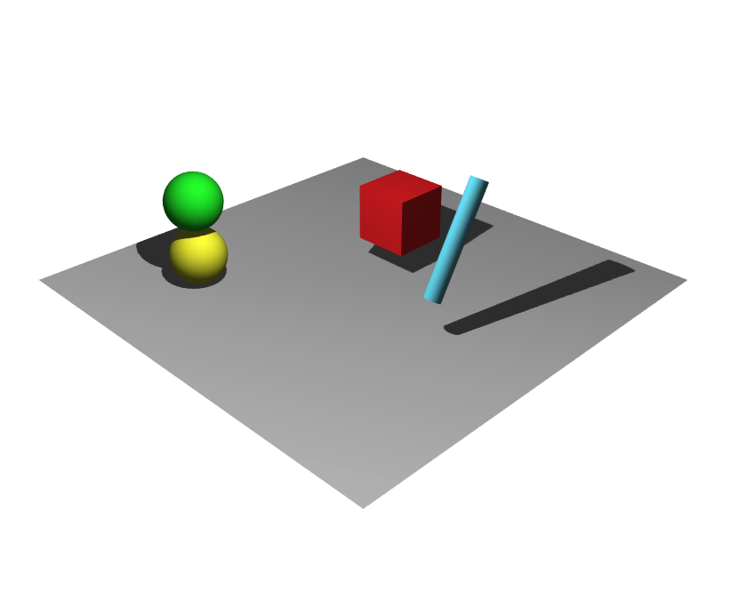

# Scène complète

Cette partie présente une scène plus complète possédant:
* Plusieurs objets, dont certains sont animés
* La possibilité de déplacer la caméra interactivement
* L'actualisation de l'affichage en cas de redimensionnement.

[_Scène obtenue_](https://htmlpreview.github.io/?https://github.com/drohmer/INF473F/blob/master/seance_01/partie_05_scene_complete/b_utilisation_module/src/index.html)

Le code de cette scène est présenté suivant deux versions.
* a: En initialisant directement chaque objet à partir des appels de l'API Three.js
* b: En encapsulant ces appels dans un module _primitive_, permettant de simplifier la création de certaines formes (typiquement cylindre, cone, etc).
