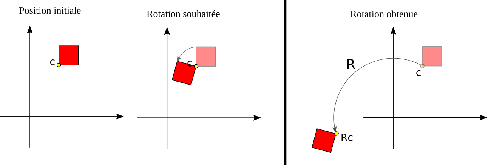
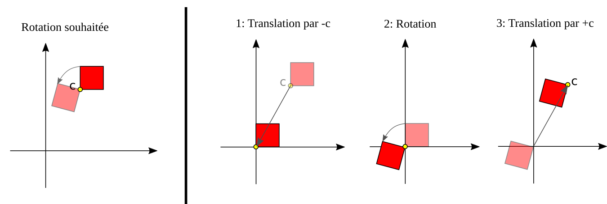
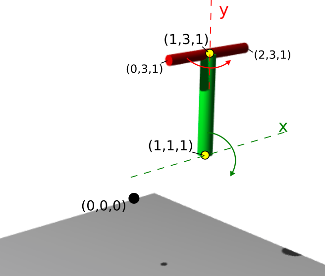

# Placement et orientation d'objets dans la scène

Cette partie présente le modèle de transformations de Three.js et différentes approches permettant de positionner vos objets dans l'espace.

## Coordonnées et matrices de transformations

Le position et l'orientation de vos objet peut se réaliser suivant deux approches
1. Par le choix de ces coordonnées définies dans la classe [Geometry](https://threejs.org/docs/#api/core/Geometry).
1. Par la mise en place de la matrice de transformation, donnée stockée dans les objets de type [Object3D](https://threejs.org/docs/#api/core/Object3D) qui est la classe parente des [Mesh](https://threejs.org/docs/#api/objects/Mesh).


* En pratique, modifier les coordonnées de la géométrie de l'objet est une opération couteuse: il faut parcourir l'ensemble des sommets par du code JavaScript et les modifier.
A l'inverse, utiliser la matrice de transformation est une opération rapide. Cette matrice est passée en paramètre à la carte graphique, et l'application de cette matrice sur les coordonnées des sommets est réalisé en parallèle sur la carte graphique.
* La matrice de transformation gère le positionnement et l'orientation hierarchique des éléments dans le graphe de scène de Three.js. Au moment de l'affichage, le graphe de scène est parcouru et la matrice de la classe parente est multipliée à la matrice de la classe fille de manière hiérarchique.

On notera donc les deux points suivants
* Pour obtenir une animation hiérarchique, il est nécessaire de définir des transformations locales par le biais de la matrice de transformation de la classe Object3D.
* Modifier la matrice de transformation de la classe Object3D, ne modifie pas les coordonnées stockées de la géométrie. (L'application de cette transformation sur les coordonnées étant une opération réalisée uniquement lors de l'affichage par la carte graphique).

## Modification de la matrice de transformation en Three.js

La matrice de transformation de chaque [objet 3D](https://threejs.org/docs/#api/core/Object3D) est la variable `matrix`, de type [Matrix4](https://threejs.org/docs/#api/math/Matrix4).
Notons que celle-ci est initialisée à la matrice identité lors de la création de l'objet (pas de rotation ni de translation).

Cette variable peut être visualisée en console. Par défault, la matrice est automatiquement complétée et synchronisée à partir de données intermédiaires de positions et d'orientations stockée dans la classe. Comme expliqué [ici](https://threejs.org/docs/#manual/introduction/Matrix-transformations), la synchronisation automatique ne permet pas de manipuler directement les éléments individuels de la matrice.

Il est ainsi conseillé de manipuler cette matrice de manière indirecte, par le biais des fonctions proposées par Three.js.


### Appliquer une transformation

Les fonctions principales permettant d'appliquer une nouvelle transformation à celle déjà  existante sont les suivantes:
* Pour la rotation:
 * `rotateX(x)`, `rotateY(y)`, `rotateZ(z)` : rotation suivant les axes principaux (en radians).
 * `rotateOnAxis(axis, angle)` : pour une rotation suivant un axe quelconque. L'axe devant être un Vector3 de longueur unitaire.
* Pour la translation:
 * `translateX(x)`, `translateY(y)`, `translateZ(z)`

_Attention_: Three.js réalise les opérations par 'post-multiplication'. L'ordre dans lequel les opérations sont écrites dans le code est à l'inverse de l'ordre dans lesquels les transformations doivent être appliquées sur les coordonnées de l'objet. <br/>

Considérons le code suivant:
```javascript
object.rotateX(Math.PI/2); // R1
object.translateY(1); // T2
object.rotateZ(Math.PI/4); // R3
```
Appelons R1, T2, R3 les matrices correspondantes à ces translations et rotation. Three.js applique les transformations dans l'ordre suivant: R1   T2   R3. La première opération appliquée aux sommets de l'objet est donc la rotation R3, et la dernière est la rotation R1.

### Définir les valeurs de la matrice de transformation

Il est également possible de définir directement les composantes de la matrice de transformation, pour cela, on pourra utiliser
* `cylinder.position.set(x,y,z);` pour la translation
* `cylinder.setRotationFromAxisAngle(Axis,angle)` pour la rotation

Notez la différence entre l'écriture de données dans la matrice (écrase les valeurs précédentes) et l'application d'une transformation (produit matricielle entre la nouvelle et l'ancienne transformation).

Il peut être pratique dans certains cas de ré-initialiser la matrice de transformation à l'identité. Pour cela, il est possible d'écrire
```javascript
cylinder.position.set(0,0,0);
cylinder.setRotationFromAxisAngle(new THREE.Vector3(1,0,0),0);
cylinder.updateMatrix(); // force la mise à jour de la matrice
```


# Application à l'orientation d'un objet

## Rappel sur la rotation et la translation

Il est courant de devoir appliquer des rotations tel que l'axe de la rotation ne passe pas par l'origine (en 2D, le centre de la rotation n'est pas confondue avec l'origine).

Considérons le cas d'un objet en 2D dont on souhaite appliquer une rotation autour du point c.
Appliquer directement la rotation sur cet objet le fait tourner autour de l'origine, et non pas autour du point c.

_Exemple d'application d'une rotation directement sur un objet non centré. Le centre de rotation est l'origine._

Pour cela, il est nécessaire de réaliser 3 étapes consécutives.

1. Translater l'objet d'un vecteur -c. De cette manière, la position de l'objet au centre de la rotation se trouve confondue avec l'origine.
* Appliquer la rotation.
* Translater à nouveau l'objet du vecteur +c. L'objet se replace ainsi à sa position d'origine.


_Application d'une rotation autour d'un pivot spécifique en trois étapes._


_Rem_. Cette transformation est similaire à l'application d'une unique transformation telle que la rotation soit donnée par R, et la translation soit donnée par c - R c.

En 3D cette approche fonctionne de la même manière. Il n'y a pas à proprement parler de _centre de rotation_, mais il s'agit cette fois d'un axe de rotation. Il faut alors appliquer une translation telle que l'axe de cette rotation passe par l'origine.

## Cas d'exemple

Considérons le cas d'application [visible ici]. Un objet est composé de deux cylindres (vert et rouge). Le cylindre rouge est attaché au cylindre vert, et est modélisé comme un enfant du cylindre rouge dans le graphe de scène.

On considère qu'à l'instant initial, on a
* l'axe du cylindre vert défini entre les points c1=(1,1,1) et c2=(1,3,1),
* l'axe du cylindre rouge défini entre les points (0,3,1) et (2,3,1).

Au niveau de l'animation,
* l'axe vert possède une rotation autour de sa base (passant par le sommet c1) et de direction x.
* l'axe rouge possède un mouvement local relatif au mouvement de l'axe vert.  Dans ce repère local, l'axe rouge possède un mouvement de rotation dont l'axe passe en son milieu (le sommet c2) et de direction y.




_Positions annotées du cas d'application._

On propose ci après différentes solutions pour réaliser cette scèen. Notez qu'en fonction du contexte l'une ou l'autre solution peut se révéler plus ou moins adaptée.


### Placer l'objet initialement dans un repère centré pour la rotation.

Une première solution consiste à définir directement l'objet (lors de sa création), non pas dans sa position réelle à l'instant initial, mais dans son repère local, tel que l'origine (0,0,0) soit positionnée sur l'axe de rotation.

Dans ce cas, au cours de l'animation, il est possible d'appliquer directement la rotation (sans translation préalable), ainsi que la translation le positionnant à la position finale souhaitée.

Exemple (code correspondant dans le répertoire `a_centrage_initial/`):

Lors de la phase de création des objets (coodonnées relatives au point pivot de la rotation):
```javascript
// Le cylindre vert
const cylinderGeometry = primitive.Cylinder( Vector3(0,0,0), Vector3(0,2,0),0.15 );
// Le cylindre rouge
const cylinderSonGeometry = primitive.Cylinder( Vector3(-1,0,0), Vector3(1,0,0),0.1 );
```

Lors de l'animation:
```javascript
cylinder.rotateX(0.01);
cylinder.position.set(1,1,1);

cylinderSon.rotateY(0.2);
cylinderSon.position.set(0,2,0);
```

[Voir résultat correspondant.](https://htmlpreview.github.io/?https://github.com/drohmer/INF473F/blob/master/seance_02/00_transformations/a_centrage_initial/index.html)

Cette approche permet d'avoir une transformation simple, mais nécessite un travail préalable de centrage de l'objet par rapport à son axe de rotation. Cette approche ne fonctionne que si la position pivot de l'objet est connue à l'avance et constante au cours du temps.


### Application de transformations successives

La seconde possibilité, plus générale, consiste à partir des coordonnées globales, et à chaque instant d'appliquer successivement
1. une translation qui place l'objet centré autour de l'axe de rotation
* la rotation
* puis replace l'objet à sa position d'origine.


Exemple (code correspondant dans le répertoire `b_application_transformations/`):

Lors de la phase de création des objets (coordonnées 3D à l'instant initial):
```javascript
// Le cylindre vert
const cylinderGeometry = primitive.Cylinder( Vector3(1,1,1), Vector3(1,3,1),0.15 );
// Le cylindre rouge
const cylinderSonGeometry = primitive.Cylinder( Vector3(0,3,1), Vector3(2,3,1),0.1 );
```

Lors de l'animation (notez l'ordre inverse des opérations dans le code)
```javascript
// Composition des transformations souhaitée:
// translation(-1,-1,-1) o rotationX(dTheta) o translation(1,1,1)
cylinder.translateX(1).translateY(1).translateZ(1);
cylinder.rotateX(0.01);
cylinder.translateX(-1).translateY(-1).translateZ(-1);

// Composition des transformations souhaitée:
// translation(-1,-3,-1) o rotationY(dPhi) o translation(1,3,1)
cylinderSon.translateX(1).translateY(3).translateZ(1);
cylinderSon.rotateY(0.2);
cylinderSon.translateX(-1).translateY(-3).translateZ(-1);
```

[Voir résultat correspondant.](https://htmlpreview.github.io/?https://github.com/drohmer/INF473F/blob/master/seance_02/00_transformations/b_application_transformations/index.html)


### Reinitialisation de la matrice à chaque pas de temps

L'exemple précédent présente le cas où la rotation est appliquée par pas successifs entre chaque affichage. La valeur de `rotate` indique ainsi la vitesse angulaire, et non pas l'orientation de l'objet. <br/>
Il est parfois préférable de définir directement l'angle d'orientation par rapport à la pose initiale. Pour cela, il est possible de ré-initialiser la matrice de transformation à chaque pas de temps de controler explicitement l'angle définit dans la matrice.

(code correspondant dans le répertoire `c_ecriture_transformations/`):

```javascript
// Place la matrice de transformation à l'identité (cylindre vert)
cylinder.position.set(0,0,0);
cylinder.setRotationFromAxisAngle(new THREE.Vector3(1,0,0),0);
cylinder.updateMatrix(); // force la mise à jour de la matrice

// Transformations
cylinder.translateX(1).translateY(1).translateZ(1);
cylinder.rotateX(t);
cylinder.translateX(-1).translateY(-1).translateZ(-1);


// Place la matrice de transformation à l'identité (cylindre rouge)
cylinderSon.position.set(0,0,0);
cylinderSon.setRotationFromAxisAngle(new THREE.Vector3(1,0,0),0);
cylinderSon.updateMatrix(); // force la mise à jour de la matrice

// Transformations
cylinderSon.translateX(1).translateY(3).translateZ(1);
cylinderSon.rotateY(8*t);
cylinderSon.translateX(-1).translateY(-3).translateZ(-1);
```

[Voir résultat correspondant.](https://htmlpreview.github.io/?https://github.com/drohmer/INF473F/blob/master/seance_02/00_transformations/c_ecriture_transformations/index.html)

### Utilisation des matrices

Une dernière possibilité consiste à gérer soit même les transformations sous forme de matrices.
Dans ce cas, la syntaxe est potentiellement plus longue que par l'utilisation des fonctions `translate` et `rotate` de Three.js. Par contre, l'ordre des opérations est gérée explicitement, et il n'est plus nécessaire d'inverser l'ordre des opérations dans le code.

(code correspondant dans le répertoire `d_matrices/`):

```javascript
// Transformation du cylindre vert
const Tinv_green = new THREE.Matrix4().makeTranslation(-1,-1,-1);
const R_green = new THREE.Matrix4().makeRotationAxis(new Vector3(1,0,0), 0.01);
const T_green = new THREE.Matrix4().makeTranslation( 1, 1, 1);

// T_green * R_green * Tinv_green
const M_green = new THREE.Matrix4().multiply(T_green).multiply(R_green).multiply(Tinv_green);

cylinder.applyMatrix(M_green);


// Transformation du cylindre rouge
const Tinv_red = new THREE.Matrix4().makeTranslation(-1,-3,-1);
const R_red = new THREE.Matrix4().makeRotationAxis(new Vector3(0,1,0), 0.2);
const T_red = new THREE.Matrix4().makeTranslation( 1, 3, 1);

// T_red * R_red * Tinv_red
const M_red = new THREE.Matrix4().multiply(T_red).multiply(R_red).multiply(Tinv_red);

cylinderSon.applyMatrix(M_red);
```

[Voir résultat correspondant.](https://htmlpreview.github.io/?https://github.com/drohmer/INF473F/blob/master/seance_02/00_transformations/d_matrices/index.html)
