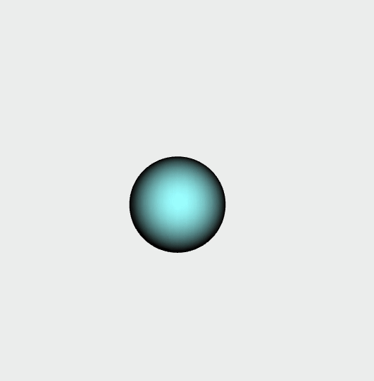

# Gestion de la souris et du clavier

JavaScript propose la gestion des évènements liés à la souris et au clavier par l'utilisation de fonction de rappels (similairement à l'interface graphique de dat.gui).

La syntaxe générale est:
```Javascript
window.addEventListener("nom de l'évènement", Callback);
```
C'est-à-dire que lorsque l'évènement désigné intervient, la fonction _Callback_ est appelée.

Notez que ces fonctions sont disponibles par défaut en JavaScript et peuvent être utilisées indépendamment de Three.js.

Le programme suivant met en oeuvre une scène simple utilisant les fonctions évènementielles dans le cas du clic de la souris.
La scène consiste en une sphère centrée sur l'origine sur laquelle l'utilisateur peut cliquer. La scène est vue par une caméra orthographique et revient à une gestion de coordonnées 2D, ce qui permet une correspondance aisée entre les coordonnées de la souris et la visualisation de la sphère.

__Q.__ Observez les différents affichages sur la console et retrouvez les appels correspondant au clic/relâchement de la souris, et l'enfoncement des touches du clavier.

__Q.__ Affichez les coordonnées de la souris à chaque déplacement, observez le résultat dans la console.

__Q.__ Déterminez où se trouvent les points (0,0), (-1,-1), (-1,1), (1,-1), et (1,1) dans le système de coordonnées lié à la fenêtre.

__Q.__ Modifiez le code de manière à pouvoir gérer la translation de la sphère similairement à un _drag and drop_.
_Aide:_ on pourra réaliser le déplacement de la sphère par translation. Pour cela, on peut mettre en mémoire la position (x,y) de la souris à l'instant précédent (MAJ à chaque déplacement de la souris). La différence entre la position actuelle et la position précédente donne alors le vecteur de déplacement à appliquer sur la sphère.


