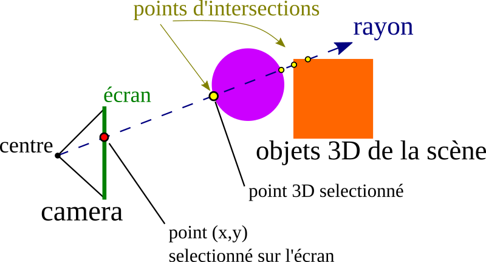

# Selection d'objets par "Raycasting"

La sélection (ou __picking__) consiste à pouvoir cliquer sur l'écran afin de sélectionner un objet (ou un point sur un objet).

Three.js propose une fonction de picking déjà codé par une approche dite de _Raycasting_.
Plus précisément, on considère un point de l'écran de coordonnées (x,y). Soit la demie-droite (appelée rayon) ayant pour origine la position de la caméra, et dirigée de manière à ce que son image par la projection de la caméra soit le point (x,y).
Le _Racasting_ consiste à calculer les intersections entre ce rayon, et les différents objets de la scène.

Dans le cas d'un picking simple, il suffira, une fois ces intersections calculées, de considérer le point d'intersection le plus proche de la caméra (voir illustration 2D suivante).

Les deux programmes suivants proposent: 
*a. Un picking simple sur un objet.
*b. Un picking et une translation interactive de l'objet selectionné.